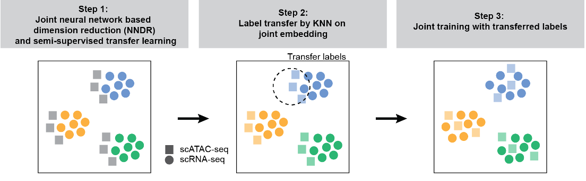
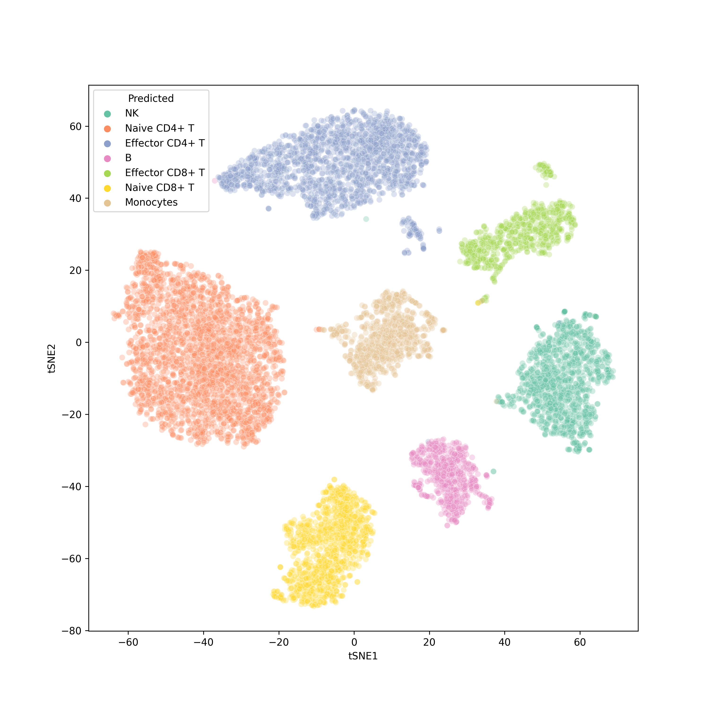

# Implementing scJoint

[TOC]

## 1 Background

Single-cell multi-omics data continues to grow at an unprecedented pace. While integrating different modalities holds the promise for better characterization of cell identities, it remains a significant computational challenge.

## 2 Existing problems

Single-cell ATAC-seq(scATAC-seq) is an epigenomic profiling technique for measuring chromatin accessibility to discover cell type specific regulatory mechanisms. scATAC-seq offers a complementary layer of information to scRNA-seq, and together they provide a more comprehensive molecular profile of individual cells and their identities.

However, it has been noted that the **extreme sparsity** of scATAC-seq data often limits its power in cell type identification.

## 3 Existing methods and drawbacks

1. While existing methods like scAI and MOFA+ have demonstrated promising results in integrating multiple modalities measured in cells from the same tissue, **requiring distributions to match globally in manifold alignment may be too restrictive for more complex data compositions as typically seen in cell atlases**, where measurements for different modalities are derived from different tissues and cell types.
2. Matrix factorisation and correlation-based methods often perform a separate feature selection step prior to integration for dimension reduction, and the method's performance can be sensitive to which genes are selected.

## 4 Proposed method

### 4.1 Advantages of scJoint model

1. scJoint addresses the main challenge of aligning these two distinct data modalities via a common lower dimensional space.
2. Using mouse cell atlases and multi-modal data with protein measurements, authors demonstrate scJoint achieves significantly higher label transfer accuracy and provides better joint visualizations than other methods even when 1) the data is highly complex and heterogeneous and 2) meaningful biological conditions are mixed with technical variations.
3. Authors have shown that integrative analysis of single-cell muti-omics data by scJoint facilitates re-annotation of cell types in scATAC-seq and discovery of new subtypes not present in training data.
4. Although designed for unpaired data, scJoint is still directly applicable to paired data and generates joint visualizations with cells coherently grouped by cell type.

The core of scJoint is a semi-supervised approach to co-train labeled data (scRNA-seq) and unlabelled data (scATAC-seq), where it addresses the main challenge of aligning these two distinct data modalities via a common lower dimensional space.

### 4.2 Methods

scJoint consists of three main steps.

- Step 1 performs joint dimension reduction and modality alignment in a common embedding space through a novel neural network based dimension reduction (NNDR) loss and s cosine similarity loss respectively.

- Step 2 treats each cell in scATAC-seq data as a query, identifies the k-nearest neighbours (KNN) among scRNAseq cells by measuring their distances in the common embedding space, and transfers the cell type labels from scRNA-seq to scATAC-seq via majority vote.
- Step 3 further improves the mixing between the two modalities by utilizing the transferred labels in a metric learning loss.

scJoint requires simple data preprocessing with the input dimension equal to the number of genes in the given datasets after appropriate filtering. Chromatin accessibility in scATAC-seq data is first converted to gene activity scores allowing for the use of a single encoder with weight sharing for both RNA and ATAC.

### 4.3 Loss function

1. **NNER Loss.** In a spirit similar to PCA, the NNDR loss aims to capture low dimensional, orthogonal features when projecting each data batch into the embedding space. 
   $$
   \begin{equation}
   	\begin{aligned}
   \mathcal{L}_{\text{NNDR}}\left( \mathcal{B},\theta \right) &=\left( \frac{1}{BD}\sum_{b\in \mathcal{B}}{\sum_{j=1}^D{\left| f_{\theta ,b}\left( j \right) -\bar{f}_{\theta ,\cdot}\left( j \right) \right|}} \right) ^{-1} \\
   &+\frac{1}{D^2}\sum_{i\ne j}{\left| \Sigma _{\theta ,\cdot}\left( i,j \right) \right|} +\frac{1}{BD}\sum_{b\in \mathcal{B}}{\sum_{j=1}^D{\left| \bar{f}_{\theta ,\cdot}\left( j \right) \right|}}
   	\end{aligned}
   \end{equation}
   $$
   

   - The first term calculates the mean of the distance from each cell to the geometric center. 
   - In the second term, $\sum_{\theta,\cdot}$ is the sample correlation matrix. 
   - The last term tries to fix the means of all coordinates near zero for model identifiability, preventing $\theta $ from drifting to unstable regions of the parameter space.

   Note that to minimise this loss, authors maximise the variability within each coordinate (**inverse of the first term**) and minimise the correlation between all coordinate pairs (the second term) to achieve orthogonality. The last term tries to fix the means of all coordinates near zero for model identifiability, preventing $\theta $ from drifting to unstable regions of the parameter space.

2. **Cosine similarity loss.** This loss is applied to the embedding layer outputs from $B(t)$ and $B_R = \cup _{s=1}^{S}\{B^{(s)}\}$ for every $t$, and attempts to maximise the similarity between best aligned ATAC and RNA data pairs.

$$
\mathcal{L}_{\cos }\left(\mathcal{B}^{(t)}, \mathcal{B}_R, \theta\right)=-\frac{1}{\lfloor B p\rfloor} \sum_{b \in \mathcal{I}_p} \cos \left(f_{\theta, b}^{(t)}, f_{\theta, i(b)}\right)
$$

3. **Cross entropy loss.**

$$
\mathcal{L}_{\text {entropy }}\left(\mathcal{B}^{(s)}, \theta\right)=-\frac{1}{B} \sum_{b \in \mathcal{B}^{(s)}} \sum_{k=1}^K 1\left(y_b^{(s)}=k\right) \log g_{\theta, b}^{(s)}(k)
$$

## 5 scJoint enables accurate integration of single-cell multi-modal data across biological condition

### 5.1 tSNE visualisation

### 5.2 Sihouette Coefficient

One popular method for measuring the quality of clusters is the **silhouette coefficient**.

**What is the Silhouette Coefficient?**

- The silhouette coefficient is a metric that measures how well each data point fits into its assigned cluster. It combines information about both the **cohesion** (how close a data point is to other points in its own cluster) and the **separation** (how far a data point is from points in other clusters) of the data point.

- The coefficient ranges from -1 to 1, where a value close to 1 indicates a well-clustered data point, a value close to 0 suggests overlapping clusters and a value close to -1 indicates a misclassified data point.

- A higher silhouette score indicates that the data points are well-clustered, with clear separation between clusters and tight cohesion within each cluster. Conversely, a lower silhouette score suggests that the clustering may be less accurate, with overlapping clusters or points that are not well-assigned to their respective clusters.

**Calculating the Silhouette Coefficient: Step-by-Step**

1. For each data point, calculate two values:

>— Average distance to all other data points within the same cluster (cohesion).
> — Average distance to all data points in the nearest neighboring cluster (separation).

2. Compute the silhouette coefficient for each data point using the formula:

> silhouette coefficient = (separation — cohesion) / max(separation, cohesion)

3. Calculate the average silhouette coefficient across all data points to obtain the overall silhouette score for the clustering result.

## 5 Data preprocessing

### 5.1 Multi-modal data (CITE-seq and ASAP-seq PBMC data)

The ASAP-seq and CITEseq data were downloaded from GEO accession number [GSE156478](https://www.ncbi.nlm.nih.gov/geo/query/acc.cgi?acc=GSE156478), which included the fragment files and antibody-derived tags (ADTs) matrices for ASAP-seq, the raw unique molecular identifier (UMI) and ADT matrices for CITE-seq, from both control and stimulated conditions.

**ASAP-seq data download**

1. [the fragment files for ASAP-seq from control condition](https://www.ncbi.nlm.nih.gov/geo/query/acc.cgi?acc=GSM4732109)

| **Supplementary file**                            | **Size** | **Download**                                                 | **File type/resource** |
| ------------------------------------------------- | -------- | ------------------------------------------------------------ | ---------------------- |
| GSM4732109_CD28_CD3_control_ASAP_fragments.tsv.gz | 802.9 Mb | [(ftp)](https://ftp.ncbi.nlm.nih.gov/geo/samples/GSM4732nnn/GSM4732109/suppl/GSM4732109_CD28_CD3_control_ASAP_fragments.tsv.gz)[(http)](https://www.ncbi.nlm.nih.gov/geo/download/?acc=GSM4732109&format=file&file=GSM4732109_CD28_CD3_control_ASAP_fragments.tsv.gz) | TSV                    |

2. [antibody-derived tags (ADTs) matrices for ASAP-seq from control condition](https://www.ncbi.nlm.nih.gov/geo/query/acc.cgi?acc=GSM4732110)

| **Supplementary file**                      | **Size** | **Download**                                                 | **File type/resource** |
| ------------------------------------------- | -------- | ------------------------------------------------------------ | ---------------------- |
| GSM4732110_CD28_CD3_control_ASAP_ADT.tsv.gz | 11.8 Mb  | [(ftp)](https://ftp.ncbi.nlm.nih.gov/geo/samples/GSM4732nnn/GSM4732110/suppl/GSM4732110_CD28_CD3_control_ASAP_ADT.tsv.gz)[(http)](https://www.ncbi.nlm.nih.gov/geo/download/?acc=GSM4732110&format=file&file=GSM4732110_CD28_CD3_control_ASAP_ADT.tsv.gz) | TSV                    |

3. [the fragment files for ASAP-seq from simulated condition](https://www.ncbi.nlm.nih.gov/geo/query/acc.cgi?acc=GSM4732111)

| **Supplementary file**                         | **Size** | **Download**                                                 | **File type/resource** |
| ---------------------------------------------- | -------- | ------------------------------------------------------------ | ---------------------- |
| GSM4732111_CD28_CD3_stim_ASAP_fragments.tsv.gz | 1.1 Gb   | [(ftp)](https://ftp.ncbi.nlm.nih.gov/geo/samples/GSM4732nnn/GSM4732111/suppl/GSM4732111_CD28_CD3_stim_ASAP_fragments.tsv.gz)[(http)](https://www.ncbi.nlm.nih.gov/geo/download/?acc=GSM4732111&format=file&file=GSM4732111_CD28_CD3_stim_ASAP_fragments.tsv.gz) | TSV                    |

4. [antibody-derived tags (ADTs) matrices for ASAP-seq from simulated condition](https://www.ncbi.nlm.nih.gov/geo/query/acc.cgi?acc=GSM4732112)

| **Supplementary file**                   | **Size** | **Download**                                                 | **File type/resource** |
| ---------------------------------------- | -------- | ------------------------------------------------------------ | ---------------------- |
| GSM4732112_CD28_CD3_stim_ASAP_ADT.tsv.gz | 14.0 Mb  | [(ftp)](https://ftp.ncbi.nlm.nih.gov/geo/samples/GSM4732nnn/GSM4732112/suppl/GSM4732112_CD28_CD3_stim_ASAP_ADT.tsv.gz)[(http)](https://www.ncbi.nlm.nih.gov/geo/download/?acc=GSM4732112&format=file&file=GSM4732112_CD28_CD3_stim_ASAP_ADT.tsv.gz) | TSV                    |

**CITE-seq data download**

1. [the raw unique molecular identifier (UMI) for CITE-seq from control condition](https://www.ncbi.nlm.nih.gov/geo/query/acc.cgi?acc=GSM4732113)

| **Supplementary file**                               | **Size** | **Download**                                                 | **File type/resource** |
| ---------------------------------------------------- | -------- | ------------------------------------------------------------ | ---------------------- |
| GSM4732113_CD28_CD3_control_CITE_GEX_barcodes.tsv.gz | 28.5 Kb  | [(ftp)](https://ftp.ncbi.nlm.nih.gov/geo/samples/GSM4732nnn/GSM4732113/suppl/GSM4732113_CD28_CD3_control_CITE_GEX_barcodes.tsv.gz)[(http)](https://www.ncbi.nlm.nih.gov/geo/download/?acc=GSM4732113&format=file&file=GSM4732113_CD28_CD3_control_CITE_GEX_barcodes.tsv.gz) | TSV                    |
| GSM4732113_CD28_CD3_control_CITE_GEX_features.tsv.gz | 297.6 Kb | [(ftp)](https://ftp.ncbi.nlm.nih.gov/geo/samples/GSM4732nnn/GSM4732113/suppl/GSM4732113_CD28_CD3_control_CITE_GEX_features.tsv.gz)[(http)](https://www.ncbi.nlm.nih.gov/geo/download/?acc=GSM4732113&format=file&file=GSM4732113_CD28_CD3_control_CITE_GEX_features.tsv.gz) | TSV                    |
| GSM4732113_CD28_CD3_control_CITE_GEX_matrix.tsv.gz   | 38.6 Mb  | [(ftp)](https://ftp.ncbi.nlm.nih.gov/geo/samples/GSM4732nnn/GSM4732113/suppl/GSM4732113_CD28_CD3_control_CITE_GEX_matrix.tsv.gz)[(http)](https://www.ncbi.nlm.nih.gov/geo/download/?acc=GSM4732113&format=file&file=GSM4732113_CD28_CD3_control_CITE_GEX_matrix.tsv.gz) | TSV                    |

2. [ADT matrices for CITE-seq from control condition](https://www.ncbi.nlm.nih.gov/geo/query/acc.cgi?acc=GSM4732114)

| **Supplementary file**                      | **Size** | **Download**                                                 | **File type/resource** |
| ------------------------------------------- | -------- | ------------------------------------------------------------ | ---------------------- |
| GSM4732114_CD28_CD3_control_CITE_ADT.tsv.gz | 41.0 Mb  | [(ftp)](https://ftp.ncbi.nlm.nih.gov/geo/samples/GSM4732nnn/GSM4732114/suppl/GSM4732114_CD28_CD3_control_CITE_ADT.tsv.gz)[(http)](https://www.ncbi.nlm.nih.gov/geo/download/?acc=GSM4732114&format=file&file=GSM4732114_CD28_CD3_control_CITE_ADT.tsv.gz) | TSV                    |

3. [the raw unique molecular identifier (UMI) for CITE-seq from simulated condition](https://www.ncbi.nlm.nih.gov/geo/query/acc.cgi?acc=GSM4732115)

| **Supplementary file**                            | **Size** | **Download**                                                 | **File type/resource** |
| ------------------------------------------------- | -------- | ------------------------------------------------------------ | ---------------------- |
| GSM4732115_CD28_CD3_stim_CITE_GEX_barcodes.tsv.gz | 21.5 Kb  | [(ftp)](https://ftp.ncbi.nlm.nih.gov/geo/samples/GSM4732nnn/GSM4732115/suppl/GSM4732115_CD28_CD3_stim_CITE_GEX_barcodes.tsv.gz)[(http)](https://www.ncbi.nlm.nih.gov/geo/download/?acc=GSM4732115&format=file&file=GSM4732115_CD28_CD3_stim_CITE_GEX_barcodes.tsv.gz) | TSV                    |
| GSM4732115_CD28_CD3_stim_CITE_GEX_features.tsv.gz | 297.6 Kb | [(ftp)](https://ftp.ncbi.nlm.nih.gov/geo/samples/GSM4732nnn/GSM4732115/suppl/GSM4732115_CD28_CD3_stim_CITE_GEX_features.tsv.gz)[(http)](https://www.ncbi.nlm.nih.gov/geo/download/?acc=GSM4732115&format=file&file=GSM4732115_CD28_CD3_stim_CITE_GEX_features.tsv.gz) | TSV                    |
| GSM4732115_CD28_CD3_stim_CITE_GEX_matrix.tsv.gz   | 36.4 Mb  | [(ftp)](https://ftp.ncbi.nlm.nih.gov/geo/samples/GSM4732nnn/GSM4732115/suppl/GSM4732115_CD28_CD3_stim_CITE_GEX_matrix.tsv.gz)[(http)](https://www.ncbi.nlm.nih.gov/geo/download/?acc=GSM4732115&format=file&file=GSM4732115_CD28_CD3_stim_CITE_GEX_matrix.tsv.gz) | TSV                    |

4. [ADT matrices for CITE-seq from simulated condition](https://www.ncbi.nlm.nih.gov/geo/query/acc.cgi?acc=GSM4732116)

| **Supplementary file**                   | **Size** | **Download**                                                 | **File type/resource** |
| ---------------------------------------- | -------- | ------------------------------------------------------------ | ---------------------- |
| GSM4732116_CD28_CD3_stim_CITE_ADT.tsv.gz | 33.5 Mb  | [(ftp)](https://ftp.ncbi.nlm.nih.gov/geo/samples/GSM4732nnn/GSM4732116/suppl/GSM4732116_CD28_CD3_stim_CITE_ADT.tsv.gz)[(http)](https://www.ncbi.nlm.nih.gov/geo/download/?acc=GSM4732116&format=file&file=GSM4732116_CD28_CD3_stim_CITE_ADT.tsv.gz) | TSV                    |

### 5.2 Mouse atlas data

**Data download**

The processed gene expression matrix and the cell type annotation of the Tabula Muris mouse data of scRNA-seq were downloaded from https://tabula-muris.ds.czbiohub.org/.

The quantitative gene activity score matrix and the cell type annotation of Mouse sci-ATAC-seq Atlas were downloaded from https://atlas.gs.washington.edu/mouse-atac/.

| Name                                                         | Last modified | Size    | Description                                                  |
| :----------------------------------------------------------- | :------------ | :------ | :----------------------------------------------------------- |
| [activity_scores.quantitative.mtx.gz](http://krishna.gs.washington.edu/content/members/ajh24/mouse_atlas_data_release/activity_score_matrices/activity_scores.quantitative.mtx.gz) | 08/02/18      | 754.1MB | Quantitative gene activity score matrix in matrix market format. |
| [activity_scores.quantitative.cells.txt](http://krishna.gs.washington.edu/content/members/ajh24/mouse_atlas_data_release/activity_score_matrices/activity_scores.quantitative.cells.txt) | 08/02/18      | 2.9MB   | Cell IDs (columns) of quantitative gene activity score matrix. |
| [activity_scores.quantitative.genes.txt](http://krishna.gs.washington.edu/content/members/ajh24/mouse_atlas_data_release/activity_score_matrices/activity_scores.quantitative.genes.txt) | 08/02/18      | 150.4KB | Gene names (common names; columns) of quantitative gene activity score matrix. |
| [activity_scores.quantitative.rds](http://krishna.gs.washington.edu/content/members/ajh24/mouse_atlas_data_release/activity_score_matrices/activity_scores.quantitative.rds) | 08/02/18      | 664.0MB | Quantitative gene activity score matrix in RDS format.       |
|                                                              |               |         |                                                              |
| [activity_scores.binarized.mtx.gz](http://krishna.gs.washington.edu/content/members/ajh24/mouse_atlas_data_release/activity_score_matrices/activity_scores.binarized.mtx.gz) | 08/02/18      | 218.1MB | Binarized gene activity score matrix in matrix market format. |
| [activity_scores.binarized.cells.txt](http://krishna.gs.washington.edu/content/members/ajh24/mouse_atlas_data_release/activity_score_matrices/activity_scores.binarized.cells.txt) | 08/02/18      | 2.9MB   | Cell IDs (columns) of binarized gene activity score matrix.  |
| [activity_scores.binarized.genes.txt](http://krishna.gs.washington.edu/content/members/ajh24/mouse_atlas_data_release/activity_score_matrices/activity_scores.binarized.genes.txt) | 08/02/18      | 150.4KB | Gene names (common names; columns) of binarized gene activity score matrix. |
| [activity_scores.binarized.rds](http://krishna.gs.washington.edu/content/members/ajh24/mouse_atlas_data_release/activity_score_matrices/activity_scores.binarized.rds) | 08/02/18      | 151.9MB | Binarized gene activity score matrix in RDS format.          |